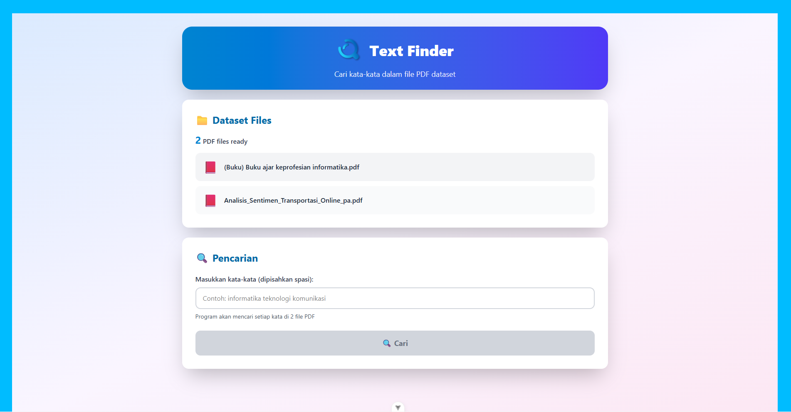
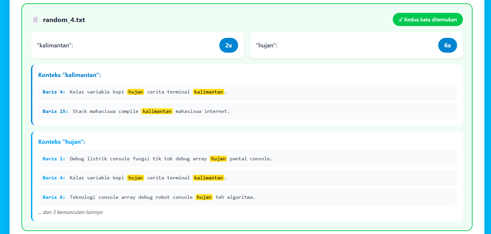
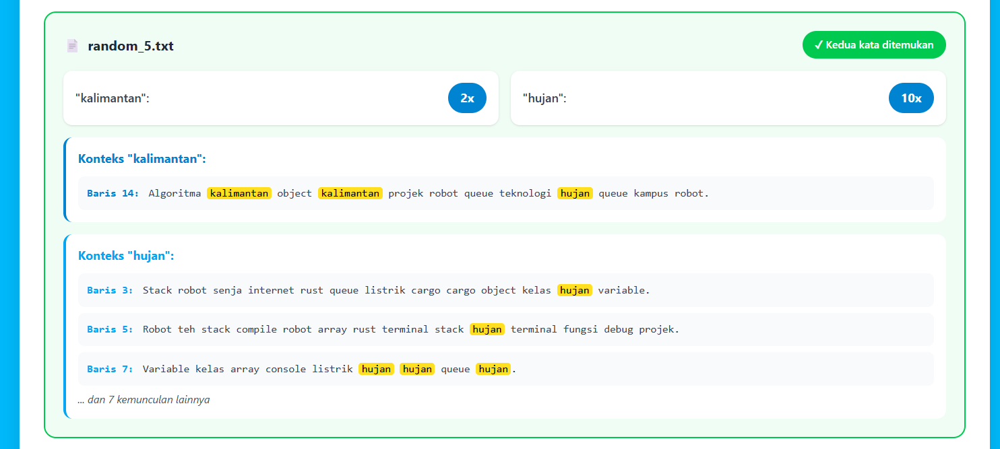
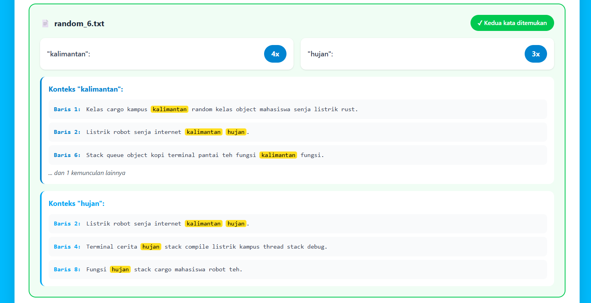

# TextSearch: Web Service Pencarian Teks Multi-Berkas Berbasis Rust dan Rocket
_A Functional Programming Approach with Rust_  
**Authors:** Abdullah Adiwarman Wildan, Daniel Belawa Koten, Dimas Ramadhani, Naufal Tiarana Putra

---

## Abstract
TextSearch adalah sebuah web service pencarian teks multi-berkas yang dibangun menggunakan bahasa pemrograman Rust dengan framework Rocket pada sisi backend dan Vue.js pada sisi frontend. Aplikasi ini memungkinkan pengguna mengunggah 2 hingga 6 berkas teks (.txt), kemudian melakukan pencarian hingga dua kata kunci secara bersamaan, menampilkan jumlah kemunculan kata per dokumen, serta konteks baris dengan highlight pada setiap kata yang ditemukan. Di sisi backend, TextSearch memanfaatkan crate Rayon untuk melakukan pemrosesan paralel di level CPU, baik saat proses parsing dan indexing kata ketika beberapa berkas diunggah sekaligus, maupun saat pencarian multi-kata kunci pada seluruh dokumen. Prinsip-prinsip pemrograman fungsional diterapkan melalui penggunaan iterator chains, higher-order functions, pengolahan data yang sebisa mungkin immutable, serta pemanfaatan tipe Option dan Result untuk penanganan error yang eksplisit dan aman. Kombinasi antara Rust, Rocket, Rayon, dan Vue.js menghasilkan sebuah prototipe layanan pencarian teks yang tidak hanya responsif dan efisien, tetapi juga memiliki struktur kode yang lebih modular, mudah diuji, dan siap untuk dikembangkan lebih lanjut.

---

## Introduction  

Perkembangan teknologi informasi membuat volume data tekstual yang dihasilkan pengguna meningkat sangat pesat, mulai dari catatan kuliah, log aplikasi, hingga dokumentasi proyek. Namun, proses pencarian teks secara manual pada banyak berkas (`.txt`) masih sering dilakukan dengan cara tradisional: membuka satu per satu file dan menggunakan fitur *find* bawaan editor. Pendekatan ini memakan waktu, rawan kesalahan, dan tidak efisien ketika jumlah file sudah mencapai beberapa buah dengan ukuran yang cukup besar.  

Berdasarkan permasalahan tersebut, proyek ini mengusulkan sebuah **aplikasi *Text Search Tool*** yang memungkinkan pengguna mengunggah 2 hingga 6 berkas teks kemudian melakukan pencarian hingga dua kata kunci secara bersamaan. Aplikasi tidak hanya menghitung jumlah kemunculan kata di setiap berkas, tetapi juga menampilkan potongan kalimat yang relevan serta menyorot (*highlight*) kata yang dicari. Dengan demikian, pengguna dapat memperoleh konteks kemunculan kata secara cepat tanpa harus membaca seluruh isi dokumen.  

Bahasa pemrograman **Rust** dipilih karena menawarkan kombinasi kinerja tinggi, keamanan memori, serta dukungan yang baik terhadap pemrograman *concurrent* dan *parallel*. Hal ini penting karena proses pencarian teks pada beberapa berkas dirancang untuk dijalankan secara **paralel di level CPU** dengan memanfaatkan **multi-threading** dan *parallel iterator* dari crate **Rayon**: saat pengguna mengunggah sedikitnya dua berkas, setiap berkas dapat diproses pada *thread* yang berbeda, dan ketika pengguna mencari lebih dari satu kata kunci, pencarian untuk tiap kata dijalankan secara paralel di seluruh dokumen.  

Integrasi konsep **pemrograman fungsional** dalam proyek ini diwujudkan melalui penggunaan *iterator*, fungsi-fungsi tingkat tinggi (*higher-order functions*), pemrosesan data yang bersifat *immutable* sebisa mungkin. Pendekatan ini membuat alur transformasi teks—mulai dari pembacaan berkas, pemecahan baris, normalisasi kata, hingga perhitungan frekuensi—menjadi lebih deklaratif, ringkas, dan mudah diuji. Dengan demikian, prinsip-prinsip pemrograman fungsional tidak hanya menjadi konsep teoretis, tetapi benar-benar diaplikasikan dalam desain logika aplikasi yang berjalan di atas eksekusi multi-threaded.  

Keunikan solusi yang dikembangkan ada pada kombinasi **Rust sebagai backend dengan kerangka kerja web Rocket** serta **antarmuka frontend berbasis Vue**. Backend bertanggung jawab terhadap pemrosesan teks yang intensif secara komputasi sekaligus mengelola eksekusi paralel di beberapa *thread*, sementara frontend memberikan pengalaman interaktif berupa unggah berkas, form pencarian, serta tampilan hasil dengan *highlight* kata kunci. Pemisahan yang jelas antara lapisan logika dan presentasi, ditambah penerapan prinsip pemrograman fungsional dan pemanfaatan multi-threading di level CPU, menjadikan proyek ini tidak hanya relevan sebagai tugas akhir mata kuliah Pemrograman Fungsional, tetapi juga berpotensi dikembangkan lebih lanjut sebagai alat bantu praktis dalam analisis teks.  

---

## Background and Concepts
Dalam era digital saat ini, pengelolaan dan pencarian informasi dari berbagai sumber data menjadi semakin penting. Dengan meningkatnya volume data yang dihasilkan, metode pencarian yang efisien dan efektif menjadi krusial untuk meningkatkan produktivitas. Pencarian teks dalam berkas-berkas besar sering kali menjadi tantangan, terutama ketika pengguna harus berurusan dengan banyak file secara bersamaan.

Konsep pemrograman fungsional menawarkan pendekatan yang berbeda dalam menangani masalah ini. Dengan memanfaatkan fungsi sebagai unit dasar pemrograman, kita dapat menciptakan solusi yang lebih modular, konsisten, dan mudah dipahami. Paradigma ini juga mendorong penggunaan data yang immutable, sehingga dapat mengurangi kesalahan akibat perubahan status yang tidak terduga. Selain itu, penggunaan higher-order functions, iterator chains, dan penanganan error berbasis Option serta Result membuat proses transformasi dan analisis teks menjadi lebih terstruktur dan aman.

Berikut ini adalah konsep-konsep teoretis yang menjadi dasar dalam pengembangan aplikasi TextSearch, sekaligus mendasari pemilihan teknologi dan arsitektur sistem yang digunakan pada proyek ini.

### Technology Stack

**Backend:**
- **Rust** - Bahasa pemrograman utama untuk backend yang dipilih karena performanya yang tinggi dan keamanan memorinya.
- **Rocket v0.5.1** - Framework web untuk membangun API yang menangani request pencarian teks. Rocket menyediakan routing dan JSON handling yang mudah digunakan.
- **Rayon v1.11** - Library untuk pemrosesan paralel yang memungkinkan pencarian teks berjalan secara concurrent pada multiple threads, sehingga lebih cepat saat memproses banyak file.
- **Serde v1.0** - Library untuk serialisasi dan deserialisasi data JSON, memudahkan pertukaran data antara backend dan frontend.
- **rocket_cors v0.6** - Middleware untuk menangani Cross-Origin Resource Sharing (CORS), diperlukan agar frontend dapat berkomunikasi dengan backend.

**Frontend:**
- **Vue.js v3.5.22** - Framework JavaScript untuk membangun user interface yang reaktif dan interaktif.
- **Vite v7.1.11** - Build tool modern yang menyediakan development server dengan Hot Module Replacement (HMR) untuk mempercepat proses development.
- **Tailwind CSS v4.1.17** - Framework CSS utility-first untuk styling yang cepat dan konsisten.
- **PostCSS & Autoprefixer** - Tools untuk memproses CSS dan menambahkan vendor prefixes secara otomatis.

Aplikasi ini menggunakan Rust untuk backend yang bertugas mencari teks di dalam file secara cepat dengan multi-threading, dan Vue.js untuk frontend yang menampilkan tampilan website agar mudah digunakan. Backend fokus pada kecepatan pemrosesan pencarian, sedangkan frontend fokus pada kemudahan pengguna saat upload file dan melihat hasil pencarian.

---

## Source Code and Explanation
### Struktur Folder
```
text-finder-with-rocket-and-vue
├── dataset
|   ├── random_1.txt
|   ├── random_2.txt
|   ├── random_3.txt
|   ├── random_4.txt
|   ├── random_5.txt
|   └── random_6.txt
├── screenshot
|   ├── result_detail_1.png
|   ├── result_detail_2.png
|   ├── result_detail_3.png
|   ├── result_detail_4.png
|   ├── result_detail_6.png
|   ├── result_word.png
|   ├── search_2_word.png
|   └── upload_file_txt.png
├── text-search-api
|   ├── src
|   |   └── main.rs
|   ├── .gitignore
|   ├── Cargo.lock
|   └── Cargo.toml
├── text-search-ui
|   ├── .vscode
|   |   └── extensions.json
|   ├── public
|   |   └── favicon.ico
|   ├── src
|   |   ├── assets
|   |   |   └── Icontextfinder.png
|   |   ├── views
|   |   |   └── HomePage.vue
|   |   ├── api.js
|   |   ├── App.vue
|   |   ├── main.js
|   |   └── style.css
|   ├── .gitignore
|   ├── index.html
|   ├── jsconfig.json
|   ├── package-lock.json
|   ├── package.json
|   ├── postcss.config.json
|   ├── README.md
|   ├── tailwind.config.js
|   └── vite.config.js
└── report.md
```

### Penjelasan Kode
#### Backend (./text-search.api)
Kode ini adalah backend API berbasis Rocket (Rust) yang berfungsi untuk:
1. Upload file berisi teks
2. Menyimpan dokumen pada memori
3. Menghitung jumlah kata pada setiap dokumen
4. Melakukan pencarian kata di seluruh dokumen
5. Menghapus dokumen satu per satu atau semuanya
6. Menghitung statistik dokumen
7. mengizinkan akses dari frontend (CORS)

Semua data disimpan menggunakan RwLock + AtomicUsize sehingga thread-safe dan bisa diproses secara paralel dengan Rayon's `par_iter()`

##### Penjelasan Bagian
Full kode dari _back-end_ dapat dilihat pada file `main.rs` yang berada di `./text-search-api/src/main.rs`

Berikut adalah sedikit penjelasan kode dari file main.rs

###### _Import Library_
```rs
extern crate rocket;
use rocket::*;
use rayon::prelude::*;
use std::sync::{RwLock, atomic::{AtomicUsize, Ordering}};
```
adalah bagian kode yang berfungsi untuk melakukan _import library_ yang dibutuhkan dengan fungsinya, yaitu sebagai berikut:
- rocket &rarr; membuat API HTTP
- rayon &rarr; mempercepat proses dengan paralel
- RwLock &rarr; menyimpan dokumen secara aman untuk multiple-thread
- AtomicUsize &rarr; membuat ID dokumen secara otomatis

###### Struktur Data Dokumen
```rs
struct Document { id, name, content, word_counts }
```
adalah sebuah blok kode yang membuat sebuah stuktur data Dokumen yang meyimpan 1 file yang telah di-upload, termasuk:
- Isi dokumen
- Jumlah kemunculan setiap kata

###### AppState (Penyimpanan Global)
```rs
struct AppState {
    docs: RwLock<Vec<Document>>,
    next_id: AtomicUsize,
}
```
adalah database sementara pada memori yang berisi:
- docs &rarr; daftar semua dokumen
- next_id &rarr; generator ID dokumen

###### Utiliy Functions
`normalize_token` &rarr; Membersihkan kata dari simbol dan _lowercase_

`tokenize` &rarr; Memecah teks menjadi daftar kata

`build_word_counts` &rarr; Menghitung jumlahs setiap kata dalam teks (HashMap)

`search_single_word` &rarr; Logika yang mencari satu kata pada seluruh dokumen:
- filter dokumen yang mengandung kata
- hitung total kemunculan
- kembalikan daftar dokumen yang sesuai

###### List Routes
Berikut adalah list _routes_ yang digunakan:
- `POST /upload` &rarr; Upload beberapa file sekaligus
- `GET /docs` &rarr; Mengambil id dan nama dokumen
- `GET /stats` &rarr; Mengembalikan statistik keseluruhan dokumen
- `POST /search` &rarr; Mencari satu atau banyak kata
- `DELETE /docs/<id>` &rarr; Menghapus dokumen tertentu berdasarkan ID.
- `DELETE /docs` &rarr; Menghapus semua dokumen dan reset `next_id` menjadi 0

#### Frontend (./text-search-ui)
_Frontend_ dibangun menggunakan bahasa pemrograman Vue yang dimana terbagi menjadi 2 bagian/file, yaitu `App.vue` dan `src/HomePage.vue`. Dengan kegunaan sebagai berikut:

##### App.vue
Adalah halaman utama aplikasi Vue yang fungsinya untuk:
1. Menampilkan animasi loading screen selama 1 detik
2. Menampilkan halaman utama (`HomePage.vue`) setelah loading selesai
3. Menggunakan TailwindCSS untuk styling dan animasi
4. Memakain Vue Composition API (`<script setup>`)

##### src/HomePage.vue
Kode ini adalah kode utama yang menampilkan halaman utama untuk website/aplikasi pencari kata dalam beberapa file .txt yang dapat:
1. Upload 2-6 file
2. Mencari 2 kata sekaligus
3. Menampilkan jumlah kemunculan
4. Menampilkan file yang tidak mengandung, mengandung kedua kata dan mengandung satu kata
5. Menampilkan 3 konteks baris per kata

## Screenshot
### Upload File (.txt)

### Masukan 2 Kata yang ingin Dicari dalam File

### Hasil Pencarian berdasarkan Kata yang Dicari

### Hasil Pencarian Kata per-File 






## Conclusion
TextSearch berhasil mengimplementasikan sebuah solusi pencarian teks multi-berkas dan dgn 2 search bar yang memanfaatkan kekuatan Rust dan prinsip pemrograman fungsional. Aplikasi ini mampu mengatasi keterbatasan metode pencarian biasa dengan menyediakan antarmuka web yang intuitif untuk mengunggah 2 hingga 6 file teks sekaligus dan melakukan pencarian paralel untuk beberapa kata kunci. Penerapan konsep pemrograman fungsional melalui penggunaan iterator chains, higher-order functions, dan data immutability telah menghasilkan kode backend yang mudah diuji. Kombinasi Rust dengan framework Rocket dan library Rayon memungkinkan eksekusi pencarian yang sangat efisien melalui pemanfaatan multi-threading, sementara frontend Vue.js memberikan pengalaman pengguna yang responsif dengan kemampuan highlight hasil pencarian. Meskipun telah berfungsi dengan baik, aplikasi ini dapat dikembangankan lebih lanjut seperti dgn penambahan support untuk format file lain. Secara keseluruhan, proyek ini membuktikan bahwa pendekatan fungsional dalam ekosistem Rust dapat menghasilkan aplikasi yang tidak hanya bagus secara performa tetapi juga maintainable dan scalable.