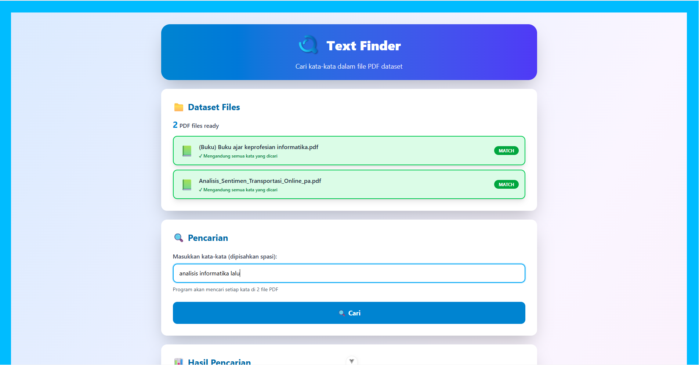
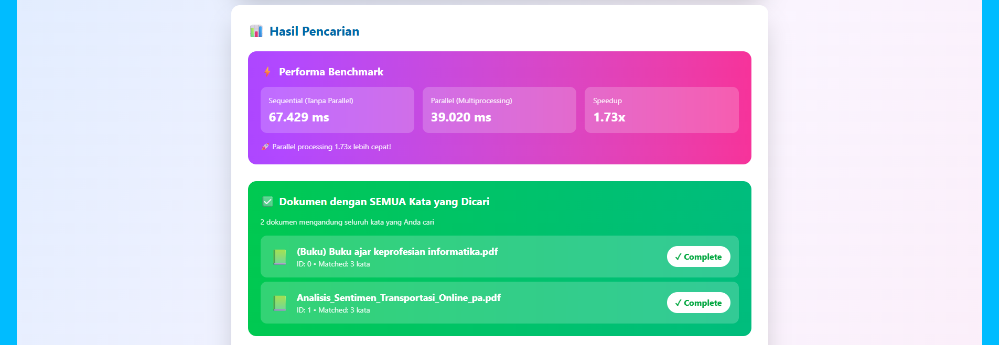
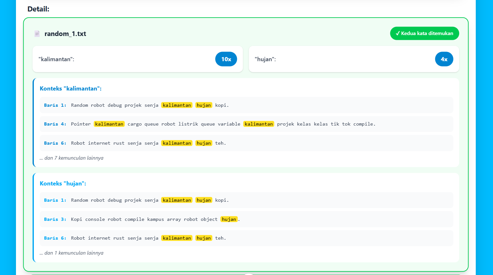
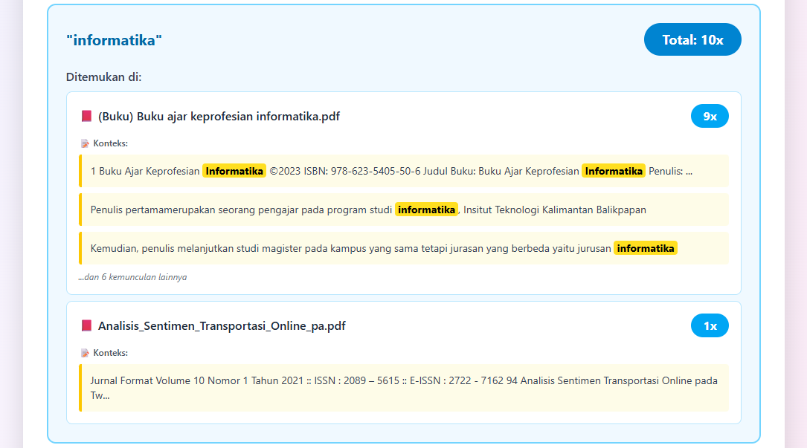
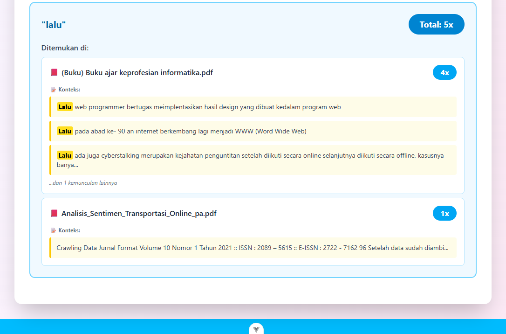

# TextSearch: Web Service Pencarian Teks Multi-Berkas Berbasis Rust dan Rocket
_A Functional Programming Approach with Rust_  
**Authors:**
1. Abdullah Adiwarman Wildan
2. Daniel Belawa Koten
3. Dimas Ramadhani
4. Naufal Tiarana Putra

---

## Abstract

## Introduction  

### Problem Statement
Perkembangan teknologi informasi membuat volume data tekstual yang dihasilkan pengguna meningkat sangat pesat, mulai dari catatan kuliah, log aplikasi, hingga dokumentasi proyek. Namun, proses pencarian teks secara manual pada banyak berkas (`.pdf`) masih sering dilakukan dengan cara tradisional: membuka satu per satu file dan menggunakan fitur *find* bawaan editor. Pendekatan ini memakan waktu, rawan kesalahan, dan tidak efisien ketika jumlah file sudah mencapai beberapa buah dengan ukuran yang cukup besar. Khususnya, pengguna tidak dapat melakukan pencarian multi-keyword secara bersamaan atau melihat konteks kemunculan kata tanpa membaca seluruh dokumen.

### Proposed Solution
Berdasarkan permasalahan tersebut, proyek ini mengusulkan sebuah aplikasi *Text Search Tool* yang memungkinkan pengguna melakukan pencarian dengan unlimited kata kunci secara bersamaan. Aplikasi tidak hanya menghitung jumlah kemunculan kata di setiap berkas, tetapi juga menampilkan potongan kalimat yang relevan serta menyorot (*highlight*) kata yang dicari. Dokumen PDF sudah tersedia dalam folder dataset server, sehingga pengguna dapat langsung melakukan pencarian tanpa perlu mengunggah file terlebih dahulu. Dengan demikian, pengguna dapat memperoleh konteks kemunkulan kata secara cepat tanpa harus membaca seluruh isi dokumen.

### Why Rust?
Bahasa pemrograman Rust dipilih karena menawarkan kombinasi yang ideal untuk aplikasi text processing. Pertama, Kinerja tinggi dengan performa yang sebanding dengan C/C++ namun lebih aman. Kedua, Keamanan memori yang mencegah data races dan memory leaks secara otomatis di compile-time. Ketiga, Dukungan excellent terhadap pemrograman concurrent dan parallel. Hal ini penting karena proses pencarian teks pada beberapa berkas dirancang untuk dijalankan secara paralel di level CPU dengan memanfaatkan multi-threading dan *parallel iterator* dari crate Rayon, saat server startup, semua file PDF dari folder dataset dimuat ke dalam memori, dan ketika pengguna melakukan pencarian dengan lebih dari satu kata kunci, pencarian untuk tiap kata dijalankan secara paralel di seluruh dokumen. Kombinasi ini memastikan aplikasi berjalan cepat sambil tetap aman dari concurrency bugs.

### Functional Programming Integration
Integrasi konsep pemrograman fungsional dalam proyek ini bukan hanya implementasi teknis, tetapi pilihan desain yang konsisten untuk meningkatkan maintainability dan testability.Terdapat 3 Alasan kami memilih Pemrograman Fungsional. Pertama, Immutability dan Pure Functions, mengurangi bugs yang sulit dilacak. Kedua, Higher-Order Functions dan Iterator Chains, membuat transformasi data lebih deklaratif dan ringkas. Ketiga,  Composability, memudahkan unit testing dan code reuse. Pendekatan ini membuat alur transformasi teks mulai dari ekstraksi teks PDF, pemecahan kalimat, normalisasi kata, hingga perhitungan frekuensi menjadi lebih deklaratif, ringkas, dan mudah diuji. Dengan demikian, prinsip-prinsip pemrograman fungsional tidak hanya menjadi konsep teoretis, tetapi benar-benar diaplikasikan dalam desain logika aplikasi yang berjalan di atas eksekusi multi-threaded.

### What Makes This Solution Unique?
Keunikan solusi yang dikembangkan terletak pada kombinasi tiga aspek. Pertama, No-Upload Paradigm yaitu dokumen PDF pre-loaded dari server at startup, memungkinkan pencarian instant tanpa delay upload, Functional Architecture yang dimana backend dibangun dengan pure functions dan immutable data yang memudahkan parallel processing, dan Multi-Level Parallelism yaitu pencarian per-keyword berjalan paralel (Rayon), berbeda dengan sistem tradisional yang hanya paralel di level dokumen. Integrasi Rust + Rocket + Vue.js menghasilkan stack yang powerful namun maintainable, dengan frontend yang responsif dan backend yang thread-safe tanpa overhead yang berat.  

---

## Background and Concepts
Dalam era digital saat ini, pengelolaan dan pencarian informasi dari berbagai sumber data menjadi semakin penting. Dengan meningkatnya volume data yang dihasilkan, metode pencarian yang efisien dan efektif menjadi krusial untuk meningkatkan produktivitas. Pencarian teks dalam berkas-berkas besar sering kali menjadi tantangan, terutama ketika pengguna harus berurusan dengan banyak file secara bersamaan.

Konsep pemrograman fungsional menawarkan pendekatan yang berbeda dalam menangani masalah ini. Dengan memanfaatkan fungsi sebagai unit dasar pemrograman, kita dapat menciptakan solusi yang lebih modular, konsisten, dan mudah dipahami. Paradigma ini juga mendorong penggunaan data yang immutable, sehingga dapat mengurangi kesalahan akibat perubahan status yang tidak terduga. Selain itu, penggunaan higher-order functions, iterator chains, dan penanganan error berbasis Option serta Result membuat proses transformasi dan analisis teks menjadi lebih terstruktur dan aman.

Berikut ini adalah konsep-konsep teoretis yang menjadi dasar dalam pengembangan aplikasi TextSearch, sekaligus mendasari pemilihan teknologi dan arsitektur sistem yang digunakan pada proyek ini.

### Technology Stack

**Backend:**
- **Rust** - Bahasa pemrograman utama untuk backend yang dipilih karena performanya yang tinggi dan keamanan memorinya.
- **Rocket v0.5.1** - Framework web untuk membangun API yang menangani request pencarian teks. Rocket menyediakan routing dan JSON handling yang mudah digunakan.
- **Rayon v1.11** - Library untuk pemrosesan paralel yang memungkinkan pencarian teks berjalan secara concurrent pada multiple threads, sehingga lebih cepat saat memproses banyak file.
- **Serde v1.0** - Library untuk serialisasi dan deserialisasi data JSON, memudahkan pertukaran data antara backend dan frontend.
- **rocket_cors v0.6** - Middleware untuk menangani Cross-Origin Resource Sharing (CORS), diperlukan agar frontend dapat berkomunikasi dengan backend.

**Frontend:**
- **Vue.js v3.5.22** - Framework JavaScript untuk membangun user interface yang reaktif dan interaktif.
- **Vite v7.1.11** - Build tool modern yang menyediakan development server dengan Hot Module Replacement (HMR) untuk mempercepat proses development.
- **Tailwind CSS v4.1.17** - Framework CSS utility-first untuk styling yang cepat dan konsisten.
- **PostCSS & Autoprefixer** - Tools untuk memproses CSS dan menambahkan vendor prefixes secara otomatis.

Aplikasi ini menggunakan Rust untuk backend yang bertugas mencari teks di dalam file secara cepat dengan multi-threading, dan Vue.js untuk frontend yang menampilkan tampilan sistem agar mudah digunakan. Backend fokus pada kecepatan pemrosesan pencarian, sedangkan frontend fokus pada kemudahan pengguna saat upload file dan melihat hasil pencarian.

---

## Source Code and Explanation

## Struktur Folder
```
text-finder-with-rocket-and-vue
├── report.md
├── dataset/
│   ├── (Buku) Buku ajar keprofesian informatika.pdf
│   └── Analisis_Sentimen_Transportasi_Online_pa.pdf
├── screenshot/
│   ├── result_detail_1.png
│   ├── result_detail_2.png
│   ├── result_detail_3.png
│   ├── result_word.png
│   ├── search_2_word.png
│   └── upload_file_pdf.png
├── text-search-api/
│   └── src/
│       ├── main.rs
│       ├── models/
│       │   ├── document.rs
│       │   ├── mod.rs
│       │   ├── request.rs
│       │   └── response.rs
│       ├── routes/
│       │   ├── document_routes.rs
│       │   ├── mod.rs
│       │   └── search_routes.rs
│       ├── services/
│       │   ├── document_service.rs
│       │   ├── mod.rs
│       │   └── search_service.rs
│       └── utils/
│           ├── mod.rs
│           ├── pdf_handler.rs
│           └── text_processor.rs
└── text-search-ui/
    ├── index.html
    ├── jsconfig.json
    ├── tailwind.config.js
    ├── vite.config.js
    ├── public/
    └── src/
        ├── api.js
        ├── App.vue
        ├── main.js
        ├── style.css
        ├── assets/
        └── views
            └── HomePage.vue
```

## Penjelasan Kode
### Backend (`./text-search.api`)
_Backend_ dibangun menggunakan kombinasi _Rust, Rocket, Rayon, dan Serde_ yang mengutamakan kecepatan, keamanan dan skalabilitas. _Backend_ terbagi menjadi menjadi beberapa folder, yaitu:

#### 1. `models`
Folder models berisi definisi struktur data yang digunakan untuk:

- Data yang diterima dari _frontend (Request Model)_ pada file `./models/request.rs`
    - Import
    ```rs
    use serde::Deserialize;
    ```

    - _Struct_: `SearchRequest`
    ```rs
    #[derive(Debug, Clone, Deserialize)]
    pub struct SearchRequest {
        pub query: String,
    }
    ```

- Data yang dikirimkan ke _frontend (Response Model)_ pada file `./models/request.rs`

    - _Import_ yang digunakan
    ```rs
    use serde::Serialize;
    use super::document::DocId;
    ```
    
    - Macro `derive_response!`
    ```rs
    macro_rules! derive_response {
        ($item:item) => {
            #[derive(Debug, Clone, Serialize)]
            $item
        };
    }
    ```
    
    - _Struct:_ `PeerDocCount`
    ```rs
    derive_response!(pub struct PerDocCount {
        pub doc_id: DocId,
        pub doc_name: String,
        pub count: usize,
        pub snippets: Vec<String>,
    });
    ```

    - _Struct_: `WordResult`
    ```rs
    derive_response!(pub struct WordResult {
        pub word: String,
        pub total_count: usize,
        pub per_doc: Vec<PerDocCount>,
    });
    ```

    - _Struct_: `BenchmarkTiming`
    ```rs
    derive_response!(pub struct BenchmarkTiming {
        pub parallel_ms: f64,
        pub sequential_ms: f64,
        pub speedup: f64,
    });
    ```

    - _Struct_: `DocumentMatch`
    ```rs
    derive_response!(pub struct DocumentMatch {
        pub doc_id: DocId,
        pub doc_name: String,
        pub matched_words: usize,
    });
    ```

    - _Struct_: `SearchResponse`
    ```rs
    derive_response!(pub struct SearchResponse {
        pub results: Vec<WordResult>,
        pub benchmark: BenchmarkTiming,
        pub docs_with_all_words: Vec<DocumentMatch>,
    });
    ```

- Representasi entitas (dokumen)
    
    - Import
    ```rs
    use serde::Serialize;
    use std::collections::HashMap;
    ```

    - Alias: `DocId`
    ```rs
    pub type DocId = usize;
    ```

    - _Struct_: `Document`
    ```rs
    #[derive(Debug, Clone)]
    pub struct Document {
        pub id: DocId,
        pub name: String,
        pub content: String,
        pub word_counts: HashMap<String, usize>,
    }
    ```

    - _Struct_: `DocumentInfo`
    ```rs
    #[derive(Debug, Clone, Serialize)]
    pub struct DocumentInfo {
        pub id: DocId,
        pub name: String,
    }
    ```

#### 2. `routes`
#### 3. `services`
#### 4. `utils`

### Frontend (`./text-search-ui`)
_Frontend_ dibangun menggunakan bahasa pemrograman Vue yang dimana terbagi menjadi 2 file, yaitu `App.vue` dan `src/HomePage.vue`. Dengan kegunaan sebagai berikut:

#### 1. `App.vue`
Adalah halaman utama sistem Vue yang fungsinya untuk:
1. Menampilkan animasi loading screen selama 1 detik
2. Menampilkan halaman utama (`HomePage.vue`) setelah loading selesai
3. Menggunakan TailwindCSS untuk styling dan animasi
4. Memakai Vue Composition API (`<script setup>`)

#### 2. `src/HomePage.vue`
File ini adalah file utama _frontend_ yang menampilkan halaman utama untuk sistem pencari kata dalam file PDF yang dapat:
1. Menampilkan daftar dokumen dari dataset yang sudah tersedia di server
2. Mencari unlimited kata kunci sekaligus
3. Menampilkan jumlah kemunculan setiap kata di setiap dokumen
4. Menampilkan dokumen yang mengandung SEMUA kata yang dicari dengan indikator visual
5. Menampilkan maksimal 3 snippet/konteks per kata dengan highlight pada kata yang dicari
6. Menampilkan benchmark performa antara parallel vs sequential search

## Screenshot
### Halaman Awal (telah disediakan 2 file .pdf)

### Masukan 2 Kata atau Lebih yang ingin Dicari dalam File

### Hasil Pencarian berdasarkan Kata yang Dicari

### Hasil Pencarian Kata per-File 




## Conclusion
TextSearch berhasil mengimplementasikan sebuah solusi pencarian teks multi-berkas yang memanfaatkan kekuatan Rust dan prinsip pemrograman fungsional. Aplikasi ini mengatasi keterbatasan metode pencarian konvensional dengan menyediakan antarmuka web yang intuitif untuk pencarian unlimited kata kunci secara bersamaan tanpa memerlukan upload file. Dokumen PDF dimuat otomatis dari folder dataset saat server startup, memungkinkan pengguna langsung melakukan pencarian. Penerapan konsep pemrograman fungsional melalui penggunaan iterator chains, higher-order functions, dan data immutability telah menghasilkan kode backend yang mudah diuji dan maintainable. Kombinasi Rust dengan framework Rocket dan library Rayon memungkinkan eksekusi pencarian yang sangat efisien melalui pemanfaatan multi-threading dengan benchmark performa, sementara frontend Vue.js memberikan pengalaman pengguna yang responsif dengan kemampuan highlight hasil pencarian dan snippet konteks. Meskipun telah berfungsi dengan baik, aplikasi ini dapat dikembangkan lebih lanjut dengan penambahan support untuk format file lain atau fitur filtering lanjutan. Secara keseluruhan, proyek ini membuktikan bahwa pendekatan fungsional dalam ekosistem Rust dapat menghasilkan aplikasi yang tidak hanya excellent dalam performa tetapi juga maintainable, scalable, dan user-friendly.